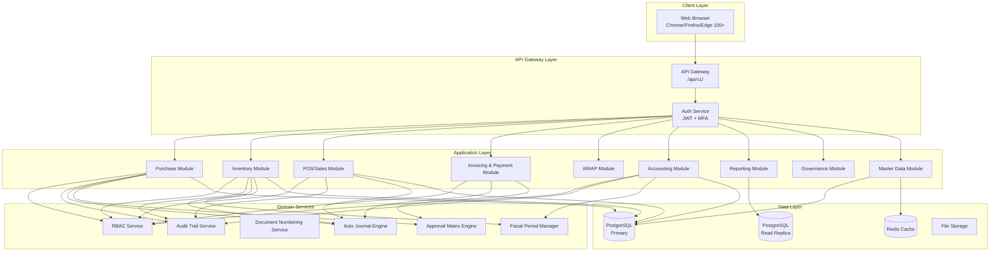
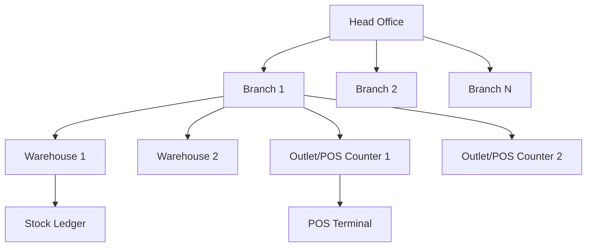
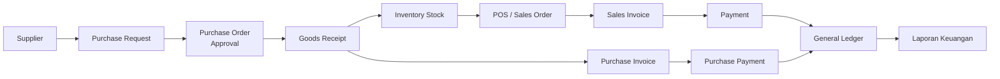
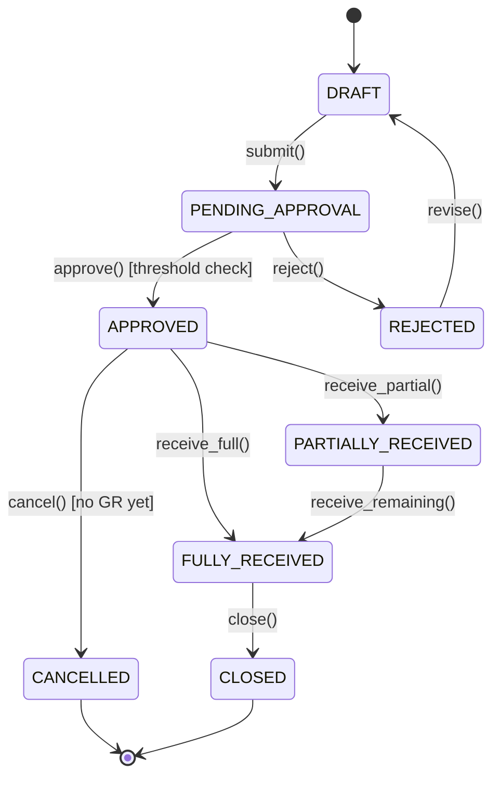
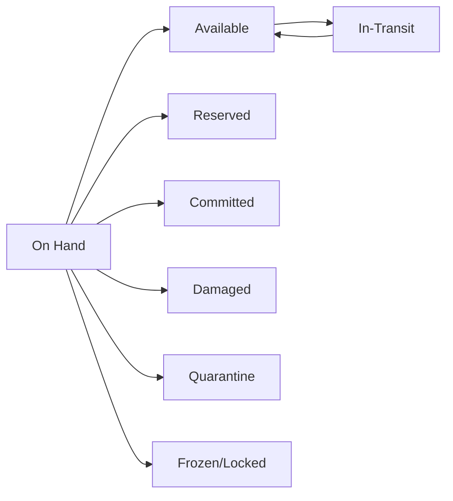
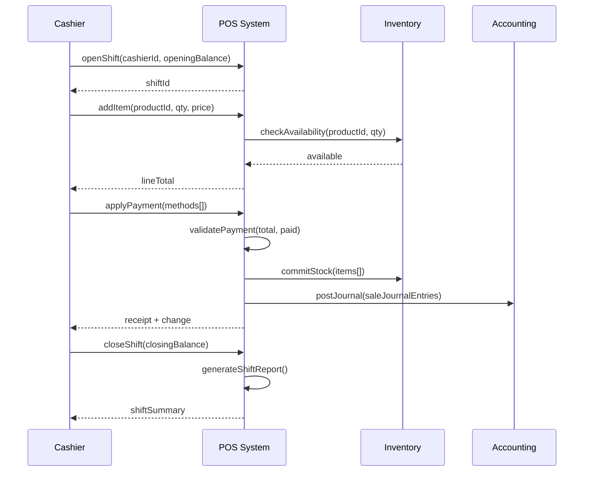
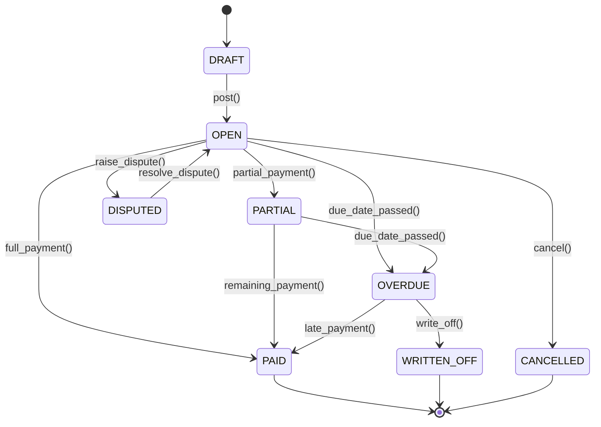
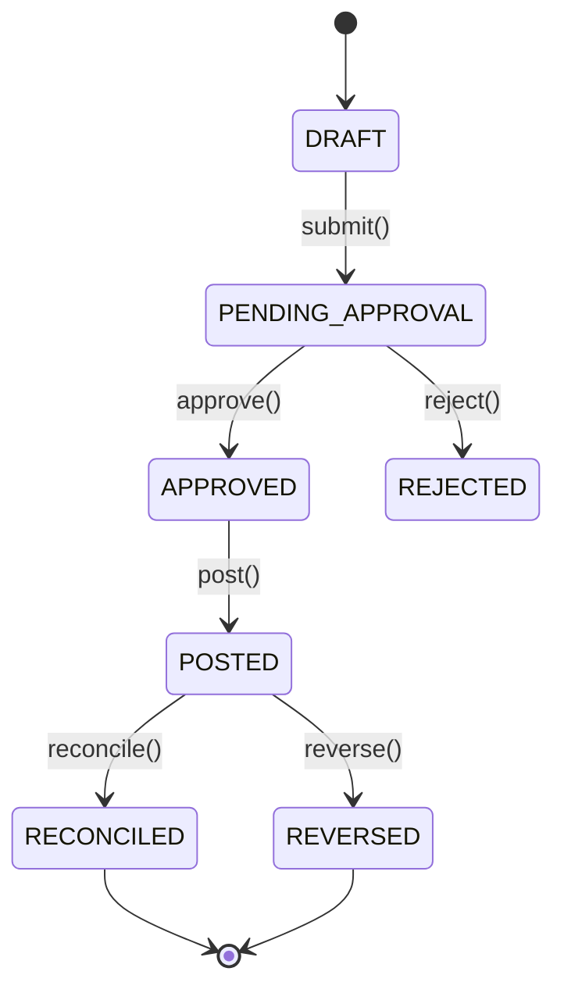

# Dokumen Desain: Enterprise Inventory + POS + Finance

## Ikhtisar

Sistem informasi manajemen enterprise berbasis web untuk industri retail distribusi Indonesia yang mengintegrasikan modul Inventory, Point of Sale (POS), Purchase/Procurement, Invoicing & Payment, Accounts Receivable/Payable (AR/AP), Accounting & Finance, serta Reporting & Analytics dalam satu platform terpadu.

Sistem dirancang untuk mendukung struktur organisasi multi-cabang dan multi-gudang dengan hierarki Head Office → Branch → Warehouse → Outlet/POS Counter, mematuhi regulasi akuntansi Indonesia (PSAK, PPN 11%, PPh, UU Kearsipan), dan mampu menangani 200 concurrent users dengan 100 concurrent POS transactions.

Arsitektur menggunakan pendekatan domain-driven design dengan 9 bounded domain (Purchase, Inventory, Sales/POS, Invoicing, AR/AP, Accounting, Reporting, Governance), database PostgreSQL dengan append-only inventory ledger dan double-entry general ledger, serta RESTful API dengan JWT authentication dan granular RBAC permission system.

## Arsitektur Sistem

### Arsitektur High-Level



### Hierarki Organisasi



### Alur Bisnis Utama



## Komponen dan Antarmuka

### 1. Master Data Module

**Tujuan**: Mengelola semua data referensi yang digunakan lintas modul.

**Entitas Utama**:
- Product/SKU, Category, Brand, UOM, Barcode
- Customer, Supplier
- Warehouse, Branch
- User, Role, Permission
- Price List, Tax Master, Payment Method
- Chart of Accounts (COA), Cost Center
- Terms of Payment, Approval Matrix
- Document Numbering, System Settings

**Antarmuka**:
```typescript
interface ProductService {
  create(data: CreateProductDTO): Promise<Product>
  update(id: UUID, data: UpdateProductDTO): Promise<Product>
  findById(id: UUID): Promise<Product>
  search(filters: ProductFilter): Promise<PaginatedResult<Product>>
  deactivate(id: UUID): Promise<void>
}

interface WarehouseService {
  create(data: CreateWarehouseDTO): Promise<Warehouse>
  findByBranch(branchId: UUID): Promise<Warehouse[]>
  lock(id: UUID, reason: string): Promise<void>
  unlock(id: UUID): Promise<void>
}

interface PriceListService {
  getActivePrice(productId: UUID, customerId: UUID, date: Date): Promise<PriceResult>
  createPriceList(data: CreatePriceListDTO): Promise<PriceList>
  updatePrices(priceListId: UUID, items: PriceItem[]): Promise<void>
}
```

---

### 2. Purchase / Procurement Module

**Tujuan**: Mengelola siklus pengadaan dari Purchase Request hingga Goods Receipt.

**State Machine Purchase Order**:



**Antarmuka**:
```typescript
interface PurchaseOrderService {
  create(data: CreatePODTO): Promise<PurchaseOrder>
  submit(id: UUID, userId: UUID): Promise<PurchaseOrder>
  approve(id: UUID, approverId: UUID, notes?: string): Promise<PurchaseOrder>
  reject(id: UUID, approverId: UUID, reason: string): Promise<PurchaseOrder>
  cancel(id: UUID, userId: UUID, reason: string): Promise<PurchaseOrder>
  receiveGoods(id: UUID, data: GoodsReceiptDTO): Promise<GoodsReceipt>
  getApprovalThreshold(amount: number): ApprovalLevel
}

interface GoodsReceiptService {
  create(poId: UUID, data: CreateGRDTO): Promise<GoodsReceipt>
  confirm(id: UUID, userId: UUID): Promise<GoodsReceipt>
  handleOverReceipt(grId: UUID, policy: OverReceiptPolicy): Promise<void>
  updateAverageCost(productId: UUID, warehouseId: UUID, newQty: number, newCost: number): Promise<void>
}
```

---

### 3. Inventory Module

**Tujuan**: Mengelola stok barang dengan append-only ledger dan kalkulasi biaya WAC/FIFO.

**Status Stok**:



**Antarmuka**:
```typescript
interface InventoryService {
  getStockBalance(productId: UUID, warehouseId: UUID): Promise<StockBalance>
  recordMovement(data: StockMovementDTO): Promise<InventoryLedgerEntry>
  transferStock(data: StockTransferDTO): Promise<StockTransfer>
  adjustStock(data: StockAdjustmentDTO, userId: UUID): Promise<StockAdjustment>
  lockWarehouse(warehouseId: UUID, reason: string): Promise<void>
  calculateAverageCost(productId: UUID, warehouseId: UUID): Promise<number>
}

interface StockOpnameService {
  initiate(warehouseId: UUID, userId: UUID): Promise<StockOpname>
  recordCount(opnameId: UUID, items: CountItem[]): Promise<void>
  requestRecount(opnameId: UUID, items: UUID[]): Promise<void>
  finalize(opnameId: UUID, userId: UUID): Promise<StockAdjustment>
}
```

---

### 4. Sales / POS Module

**Tujuan**: Mengelola transaksi penjualan ritel (POS) dan B2B (Sales Order) dengan manajemen shift kasir.

**Alur POS**:



**Antarmuka**:
```typescript
interface POSService {
  openShift(data: OpenShiftDTO): Promise<Shift>
  createTransaction(shiftId: UUID, data: POSTransactionDTO): Promise<POSTransaction>
  addItem(transactionId: UUID, item: POSLineItemDTO): Promise<POSTransaction>
  holdTransaction(transactionId: UUID): Promise<void>
  resumeTransaction(transactionId: UUID): Promise<POSTransaction>
  applyPayment(transactionId: UUID, payments: PaymentMethodDTO[]): Promise<Receipt>
  voidTransaction(transactionId: UUID, supervisorId: UUID, reason: string): Promise<void>
  closeShift(shiftId: UUID, closingBalance: number): Promise<ShiftReport>
}

interface SalesOrderService {
  create(data: CreateSODTO): Promise<SalesOrder>
  approve(id: UUID, userId: UUID): Promise<SalesOrder>
  fulfill(id: UUID, data: FulfillmentDTO): Promise<DeliveryOrder>
  createReturn(soId: UUID, data: SalesReturnDTO): Promise<SalesReturn>
}
```

---

### 5. Invoicing & Payment Module

**Tujuan**: Mengelola siklus hidup invoice dan pembayaran dengan alokasi multi-invoice.

**State Machine Invoice**:



**State Machine Payment**:



**Antarmuka**:
```typescript
interface InvoiceService {
  createSalesInvoice(data: CreateSalesInvoiceDTO): Promise<Invoice>
  createPurchaseInvoice(data: CreatePurchaseInvoiceDTO): Promise<Invoice>
  post(id: UUID, userId: UUID): Promise<Invoice>
  applyPayment(invoiceId: UUID, paymentId: UUID, amount: number): Promise<InvoiceAllocation>
  dispute(id: UUID, reason: string): Promise<Invoice>
  writeOff(id: UUID, userId: UUID, reason: string): Promise<Invoice>
}

interface PaymentService {
  createPayment(data: CreatePaymentDTO): Promise<Payment>
  approve(id: UUID, approverId: UUID): Promise<Payment>
  post(id: UUID, userId: UUID): Promise<Payment>
  allocateToInvoices(paymentId: UUID, allocations: AllocationDTO[]): Promise<void>
  reverse(id: UUID, userId: UUID, reason: string): Promise<Payment>
  reconcile(id: UUID, bankStatementRef: string): Promise<Payment>
}
```

---

### 6. Accounting Module

**Tujuan**: Mengelola General Ledger double-entry, COA standar Indonesia, fiscal period, dan auto journal.

**Antarmuka**:
```typescript
interface AccountingService {
  postJournalEntry(data: JournalEntryDTO): Promise<JournalEntry>
  reverseJournalEntry(id: UUID, userId: UUID, reason: string): Promise<JournalEntry>
  getTrialBalance(periodId: UUID, branchId?: UUID): Promise<TrialBalance>
  closePeriod(periodId: UUID, userId: UUID): Promise<FiscalPeriod>
  getAccountBalance(accountId: UUID, asOfDate: Date): Promise<AccountBalance>
}

interface AutoJournalEngine {
  processEvent(event: BusinessEvent): Promise<JournalEntry[]>
  getJournalTemplate(eventType: JournalEventType): Promise<JournalTemplate>
  validateBalance(entries: JournalLine[]): boolean
}

interface BankReconciliationService {
  importBankStatement(data: BankStatementDTO): Promise<BankStatement>
  autoMatch(statementId: UUID): Promise<ReconciliationResult>
  manualMatch(statementLineId: UUID, paymentId: UUID): Promise<void>
  getOutstandingItems(bankAccountId: UUID): Promise<OutstandingItems>
}
```

---

### 7. Reporting Module

**Tujuan**: Menyediakan laporan keuangan, inventory, dan operasional dengan data dari read replica.

**Antarmuka**:
```typescript
interface ReportingService {
  getExecutiveDashboard(params: DashboardParams): Promise<ExecutiveDashboard>
  getTrialBalance(params: TrialBalanceParams): Promise<TrialBalanceReport>
  getIncomeStatement(params: PeriodParams): Promise<IncomeStatement>
  getBalanceSheet(params: AsOfDateParams): Promise<BalanceSheet>
  getCashFlow(params: PeriodParams): Promise<CashFlowStatement>
  getARAgingReport(params: AgingParams): Promise<ARAgingReport>
  getAPAgingReport(params: AgingParams): Promise<APAgingReport>
  getStockPositionReport(params: StockParams): Promise<StockPositionReport>
  getStockMovementReport(params: MovementParams): Promise<StockMovementReport>
  getSalesReport(params: SalesParams): Promise<SalesReport>
  getShiftReport(shiftId: UUID): Promise<ShiftReport>
}
```

---

### 8. Governance Module

**Tujuan**: Mengelola RBAC, audit trail, approval matrix, dan period locking.

**Antarmuka**:
```typescript
interface RBACService {
  checkPermission(userId: UUID, permission: Permission): Promise<boolean>
  getUserPermissions(userId: UUID): Promise<Permission[]>
  assignRole(userId: UUID, roleId: UUID): Promise<void>
  createRole(data: CreateRoleDTO): Promise<Role>
  grantPermission(roleId: UUID, permission: Permission): Promise<void>
}

interface AuditTrailService {
  record(event: AuditEvent): Promise<AuditLog>
  query(filters: AuditFilter): Promise<PaginatedResult<AuditLog>>
}

interface ApprovalMatrixService {
  getApprovalChain(documentType: DocumentType, amount: number, branchId: UUID): Promise<ApprovalChain>
  submitForApproval(documentId: UUID, documentType: DocumentType): Promise<ApprovalRequest>
  processApproval(requestId: UUID, approverId: UUID, decision: ApprovalDecision): Promise<void>
  escalate(requestId: UUID): Promise<void>
}
```

## Data Model

### Entitas Inti

#### Product / SKU

```typescript
interface Product {
  id: UUID                        // PK, auto-generate
  code: string                    // unique, max 50 char
  barcode: string | null          // EAN-13/Code128
  name: string                    // max 200 char
  description: string | null
  category_id: UUID               // FK categories
  brand_id: UUID | null           // FK brands
  uom_id: UUID                    // FK units_of_measure (base UOM)
  uom_purchase_id: UUID | null    // FK UOM untuk pembelian
  uom_sales_id: UUID | null       // FK UOM untuk penjualan
  cost_method: "WAC" | "FIFO"
  standard_cost: number           // >= 0
  selling_price: number           // >= 0
  min_selling_price: number       // floor price, >= 0
  reorder_point: number           // >= 0
  reorder_qty: number             // >= 0
  max_stock: number | null        // >= reorder_point jika diisi
  is_serialized: boolean
  is_batch_tracked: boolean
  is_active: boolean
  tax_category: string | null     // untuk PPN
  weight: number | null           // kg
  volume: number | null           // m3
  image_url: string | null
  notes: string | null
  created_at: timestamp
  updated_at: timestamp
  deleted_at: timestamp | null    // soft delete
}
```

#### Warehouse

```typescript
interface Warehouse {
  id: UUID
  code: string                    // unique per branch
  name: string
  branch_id: UUID                 // FK branches
  address: string | null
  is_active: boolean
  is_locked: boolean              // true saat opname
  lock_reason: string | null
  locked_at: timestamp | null
  locked_by: UUID | null
  created_at: timestamp
  updated_at: timestamp
  deleted_at: timestamp | null
}
```

#### Inventory Ledger (Append-Only)

```typescript
interface InventoryLedger {
  id: UUID
  product_id: UUID
  warehouse_id: UUID
  transaction_type: InventoryTransactionType  // GR, SO, TRANSFER_IN, TRANSFER_OUT, ADJUSTMENT, OPNAME, RETURN_IN, RETURN_OUT
  reference_type: string          // PO, SO, TO, SA, etc.
  reference_id: UUID
  reference_number: string
  movement_date: date
  qty_in: number                  // >= 0
  qty_out: number                 // >= 0
  unit_cost: number               // >= 0
  total_cost: number              // qty * unit_cost
  running_qty: number             // computed: balance setelah transaksi
  running_cost: number            // computed: total nilai stok
  batch_number: string | null
  serial_number: string | null
  notes: string | null
  created_by: UUID
  created_at: timestamp
  // NO updated_at, NO deleted_at - append-only!
}
```

**Aturan**: `balance = SUM(qty_in) - SUM(qty_out)` per (product_id, warehouse_id)

#### Purchase Order

```typescript
interface PurchaseOrder {
  id: UUID
  po_number: string               // auto-generate: PO-YYYYMM-XXXXX
  pr_id: UUID | null              // FK purchase_requests
  supplier_id: UUID               // FK suppliers
  branch_id: UUID
  warehouse_id: UUID
  status: POStatus                // DRAFT|PENDING_APPROVAL|APPROVED|PARTIALLY_RECEIVED|FULLY_RECEIVED|CANCELLED|CLOSED
  order_date: date
  expected_delivery_date: date | null
  currency: string                // default IDR
  exchange_rate: number           // default 1
  subtotal: number                // computed
  tax_amount: number              // computed
  additional_cost: number         // default 0
  total_amount: number            // computed
  approval_level: number          // 1|2|3 berdasarkan threshold
  approved_by: UUID | null
  approved_at: timestamp | null
  notes: string | null
  terms_of_payment_id: UUID | null
  created_by: UUID
  created_at: timestamp
  updated_at: timestamp
  deleted_at: timestamp | null
}

interface PurchaseOrderLine {
  id: UUID
  po_id: UUID
  product_id: UUID
  description: string | null
  qty_ordered: number             // > 0
  qty_received: number            // >= 0, <= qty_ordered * (1 + tolerance)
  uom_id: UUID
  unit_price: number              // >= 0
  discount_pct: number            // 0-100
  discount_amount: number         // computed
  tax_pct: number                 // 0|11 (PPN)
  tax_amount: number              // computed
  line_total: number              // computed
  line_status: "OPEN" | "PARTIAL" | "CLOSED"
  created_at: timestamp
  updated_at: timestamp
}
```

#### Journal Entry (Double-Entry)

```typescript
interface JournalEntry {
  id: UUID
  je_number: string               // auto-generate: JE-YYYYMM-XXXXX
  entry_date: date
  period_id: UUID                 // FK fiscal_periods
  reference_type: string          // GR, SINV, PINV, PAYMENT, SA, etc.
  reference_id: UUID
  reference_number: string
  description: string
  total_debit: number             // computed, must equal total_credit
  total_credit: number            // computed
  status: "DRAFT" | "POSTED" | "REVERSED"
  is_auto_generated: boolean
  reversed_by: UUID | null        // FK journal_entries (reversal JE)
  reversed_at: timestamp | null
  posted_by: UUID | null
  posted_at: timestamp | null
  created_by: UUID
  created_at: timestamp
  updated_at: timestamp
}

interface JournalEntryLine {
  id: UUID
  je_id: UUID
  line_number: number             // urutan dalam JE
  account_id: UUID                // FK chart_of_accounts
  cost_center_id: UUID | null
  description: string | null
  debit: number                   // >= 0
  credit: number                  // >= 0
  // Constraint: NOT (debit > 0 AND credit > 0) - tidak boleh keduanya > 0
  // Constraint: debit >= 0 AND credit >= 0
  created_at: timestamp
}
```

**Aturan**: `SUM(debit) = SUM(credit)` per journal entry

#### POS Transaction

```typescript
interface POSTransaction {
  id: UUID
  transaction_number: string      // auto-generate: POS-YYYYMMDD-XXXXX
  shift_id: UUID                  // FK shifts
  cashier_id: UUID
  customer_id: UUID | null
  transaction_date: timestamp
  status: "OPEN" | "HELD" | "COMPLETED" | "VOIDED"
  subtotal: number                // computed
  discount_amount: number
  tax_amount: number              // computed PPN
  total_amount: number            // computed
  paid_amount: number
  change_amount: number           // paid - total
  void_reason: string | null
  voided_by: UUID | null
  voided_at: timestamp | null
  created_at: timestamp
  updated_at: timestamp
}

interface POSTransactionLine {
  id: UUID
  transaction_id: UUID
  product_id: UUID
  qty: number                     // > 0
  uom_id: UUID
  unit_price: number              // >= min_selling_price (kecuali ada override)
  price_override: boolean
  price_override_by: UUID | null
  discount_pct: number            // 0-100
  discount_amount: number
  tax_pct: number
  tax_amount: number
  line_total: number
  created_at: timestamp
}
```

#### Chart of Accounts (COA)

```typescript
interface ChartOfAccount {
  id: UUID
  account_code: string            // unique, format: X.XXX.XXX
  account_name: string
  account_type: AccountType       // ASSET|LIABILITY|EQUITY|REVENUE|EXPENSE|COGS|OTHER_INCOME|OTHER_EXPENSE
  account_category: string        // sub-klasifikasi
  parent_id: UUID | null          // FK chart_of_accounts (hierarki)
  level: number                   // 1-5
  is_header: boolean              // header tidak bisa diposting
  normal_balance: "DEBIT" | "CREDIT"
  is_active: boolean
  is_system: boolean              // tidak bisa dihapus
  branch_id: UUID | null          // null = semua cabang
  created_at: timestamp
  updated_at: timestamp
  deleted_at: timestamp | null
}
```

### Skema Penomoran Dokumen

| Dokumen | Format | Contoh |
|---------|--------|--------|
| Purchase Request | PR-YYYYMM-XXXXX | PR-202501-00001 |
| Purchase Order | PO-YYYYMM-XXXXX | PO-202501-00001 |
| Goods Receipt | GR-YYYYMM-XXXXX | GR-202501-00001 |
| Sales Invoice | INV-YYYYMM-XXXXX | INV-202501-00001 |
| POS Transaction | POS-YYYYMMDD-XXXXX | POS-20250115-00001 |
| Payment Receipt | RCV-YYYYMM-XXXXX | RCV-202501-00001 |
| Payment Voucher | PV-YYYYMM-XXXXX | PV-202501-00001 |
| Journal Entry | JE-YYYYMM-XXXXX | JE-202501-00001 |
| Stock Adjustment | SA-YYYYMM-XXXXX | SA-202501-00001 |
| Stock Opname | SO-YYYYMM-XXXXX | SO-202501-00001 |
| Credit Note | CN-YYYYMM-XXXXX | CN-202501-00001 |
| Debit Note | DN-YYYYMM-XXXXX | DN-202501-00001 |
| Transfer Order | TO-YYYYMM-XXXXX | TO-202501-00001 |

## RBAC & User Personas

### Struktur Permission

Format permission: `MODULE.ACTION`

**Modul**: PURCHASE, INVENTORY, SALES, POS, INVOICE, PAYMENT, ACCOUNTING, REPORT, ADMIN

**Aksi Standar**: READ, CREATE, UPDATE, DELETE, APPROVE, VOID, POST, LOCK, EXPORT, IMPORT

**Permission Khusus**:
- `PRICE.OVERRIDE` - Override harga jual di bawah floor price
- `DISCOUNT.OVERRIDE` - Override diskon melebihi batas
- `STOCK.ADJUST` - Melakukan penyesuaian stok manual
- `STOCK.OPNAME` - Memulai dan menyelesaikan stock opname
- `PERIOD.CLOSE` - Menutup fiscal period
- `JOURNAL.REVERSE` - Membalik journal entry
- `REPORT.FINANCIAL` - Akses laporan keuangan
- `REPORT.EXECUTIVE` - Akses executive dashboard
- `ADMIN.SETTINGS` - Mengubah system settings
- `ADMIN.USER` - Manajemen user dan role

### Matriks Akses per Persona

| Permission | Owner | Sys Admin | Fin Mgr | Fin Staff | WH Mgr | WH Staff | Cashier | Supervisor | Purchasing | Auditor |
|-----------|-------|-----------|---------|-----------|--------|----------|---------|------------|------------|---------|
| PURCHASE.APPROVE | ✓ | - | ✓ | - | - | - | - | - | - | - |
| PURCHASE.CREATE | - | - | - | - | - | - | - | - | ✓ | - |
| INVENTORY.ADJUST | - | - | - | - | ✓ | - | - | - | - | - |
| STOCK.OPNAME | - | - | - | - | ✓ | - | - | - | - | - |
| POS.VOID | - | - | - | - | - | - | - | ✓ | - | - |
| PRICE.OVERRIDE | - | - | - | - | - | - | - | ✓ | - | - |
| PERIOD.CLOSE | - | - | ✓ | - | - | - | - | - | - | - |
| JOURNAL.REVERSE | - | - | ✓ | - | - | - | - | - | - | - |
| REPORT.FINANCIAL | ✓ | - | ✓ | ✓ | - | - | - | - | - | ✓ |
| REPORT.EXECUTIVE | ✓ | - | ✓ | - | - | - | - | - | - | - |
| ADMIN.USER | - | ✓ | - | - | - | - | - | - | - | - |

### Approval Matrix Purchase Order

| Level | Threshold | Approver |
|-------|-----------|---------|
| Level 1 | < Rp 5.000.000 | Supervisor Cabang |
| Level 2 | Rp 5.000.000 - Rp 50.000.000 | Finance Manager |
| Level 3 | > Rp 50.000.000 | Owner/Direktur |

## Algoritma dan Logika Bisnis

### Algoritma Weighted Average Cost (WAC)

```pascal
ALGORITHM calculateWeightedAverageCost(productId, warehouseId, incomingQty, incomingCost)
INPUT:
  productId: UUID
  warehouseId: UUID
  incomingQty: number  -- qty barang masuk (> 0)
  incomingCost: number -- total nilai barang masuk (>= 0)
OUTPUT:
  newAverageCost: number

PRECONDITIONS:
  - incomingQty > 0
  - incomingCost >= 0
  - productId dan warehouseId valid dan aktif

BEGIN
  currentQty    <- SUM(qty_in - qty_out) FROM inventory_ledger
                   WHERE product_id = productId AND warehouse_id = warehouseId
  currentValue  <- currentQty * currentAverageCost

  IF currentQty < 0 THEN
    RAISE BusinessRuleViolation("BR-INV-001: Stok tidak boleh negatif")
  END IF

  totalQty   <- currentQty + incomingQty
  totalValue <- currentValue + incomingCost

  IF totalQty = 0 THEN
    newAverageCost <- 0
  ELSE
    newAverageCost <- ROUND(totalValue / totalQty, 4)
  END IF

  ASSERT newAverageCost >= 0  -- BR-INV-003

  RETURN newAverageCost
END

POSTCONDITIONS:
  - newAverageCost >= 0
  - newAverageCost = (currentValue + incomingCost) / (currentQty + incomingQty)
    jika totalQty > 0
```

**Contoh Kalkulasi**:
- Stok awal: 100 unit @ Rp 10.000 = Rp 1.000.000
- Penerimaan: 50 unit @ Rp 12.000 = Rp 600.000
- WAC baru: (1.000.000 + 600.000) / (100 + 50) = Rp 10.667

---

### Algoritma Validasi Journal Entry (Double-Entry)

```pascal
ALGORITHM validateJournalBalance(journalLines)
INPUT:
  journalLines: JournalLine[]
OUTPUT:
  isValid: boolean

PRECONDITIONS:
  - journalLines tidak kosong (length >= 2)
  - Setiap line: debit >= 0 AND credit >= 0
  - Setiap line: NOT (debit > 0 AND credit > 0)

BEGIN
  totalDebit  <- 0
  totalCredit <- 0

  FOR each line IN journalLines DO
    ASSERT line.debit >= 0 AND line.credit >= 0
    ASSERT NOT (line.debit > 0 AND line.credit > 0)

    totalDebit  <- totalDebit + line.debit
    totalCredit <- totalCredit + line.credit
  END FOR

  ASSERT totalDebit > 0  -- minimal ada satu sisi
  ASSERT totalCredit > 0

  difference <- ABS(totalDebit - totalCredit)

  IF difference <= 0.01 THEN  -- toleransi pembulatan
    RETURN true
  ELSE
    RAISE BusinessRuleViolation(
      "BR-ACC-001: Journal tidak balance. Debit=" + totalDebit +
      " Credit=" + totalCredit + " Selisih=" + difference
    )
  END IF
END

POSTCONDITIONS:
  - Jika return true: |SUM(debit) - SUM(credit)| <= 0.01
  - Jika raise exception: journal tidak diposting
```

---

### Algoritma Auto Journal - Goods Receipt

```pascal
ALGORITHM generateGoodsReceiptJournal(goodsReceipt)
INPUT:
  goodsReceipt: GoodsReceipt
OUTPUT:
  journalEntry: JournalEntry

PRECONDITIONS:
  - goodsReceipt.status = "CONFIRMED"
  - goodsReceipt.total_amount > 0
  - Fiscal period tidak terkunci

BEGIN
  lines <- []

  FOR each grLine IN goodsReceipt.lines DO
    inventoryValue <- grLine.qty_received * grLine.unit_cost

    -- Debit: Persediaan Barang
    lines.APPEND({
      account: getAccount("INVENTORY_ASSET"),
      debit: inventoryValue,
      credit: 0,
      description: "GR " + goodsReceipt.gr_number + " - " + grLine.product.name
    })

    -- Credit: Hutang Dagang / GR Clearing
    lines.APPEND({
      account: getAccount("GR_CLEARING"),
      debit: 0,
      credit: inventoryValue,
      description: "GR " + goodsReceipt.gr_number + " - " + grLine.product.name
    })
  END FOR

  -- Biaya tambahan (jika ada)
  IF goodsReceipt.additional_cost > 0 THEN
    lines.APPEND({
      account: getAccount("INVENTORY_ASSET"),
      debit: goodsReceipt.additional_cost,
      credit: 0,
      description: "Additional cost GR " + goodsReceipt.gr_number
    })
    lines.APPEND({
      account: getAccount("GR_CLEARING"),
      debit: 0,
      credit: goodsReceipt.additional_cost,
      description: "Additional cost GR " + goodsReceipt.gr_number
    })
  END IF

  ASSERT validateJournalBalance(lines) = true

  journalEntry <- createJournalEntry({
    entry_date: goodsReceipt.receipt_date,
    reference_type: "GR",
    reference_id: goodsReceipt.id,
    lines: lines,
    is_auto_generated: true
  })

  RETURN journalEntry
END
```

---

### Algoritma Auto Journal - POS Sale

```pascal
ALGORITHM generatePOSSaleJournal(posTransaction)
INPUT:
  posTransaction: POSTransaction
OUTPUT:
  journalEntries: JournalEntry[]

PRECONDITIONS:
  - posTransaction.status = "COMPLETED"
  - posTransaction.total_amount > 0

BEGIN
  entries <- []

  -- Journal 1: Penerimaan Kas
  cashLines <- []
  FOR each payment IN posTransaction.payments DO
    cashAccount <- getCashAccount(payment.method)  -- Kas/Bank/EDC
    cashLines.APPEND({ account: cashAccount, debit: payment.amount, credit: 0 })
  END FOR
  cashLines.APPEND({
    account: getAccount("SALES_REVENUE"),
    debit: 0,
    credit: posTransaction.subtotal
  })
  IF posTransaction.tax_amount > 0 THEN
    cashLines.APPEND({
      account: getAccount("PPN_OUTPUT"),
      debit: 0,
      credit: posTransaction.tax_amount
    })
  END IF
  entries.APPEND(createJournalEntry({ lines: cashLines, reference_type: "POS" }))

  -- Journal 2: COGS
  cogsLines <- []
  FOR each line IN posTransaction.lines DO
    avgCost <- getAverageCost(line.product_id, posTransaction.warehouse_id)
    cogsValue <- line.qty * avgCost

    cogsLines.APPEND({ account: getAccount("COGS"), debit: cogsValue, credit: 0 })
    cogsLines.APPEND({ account: getAccount("INVENTORY_ASSET"), debit: 0, credit: cogsValue })
  END FOR
  entries.APPEND(createJournalEntry({ lines: cogsLines, reference_type: "POS" }))

  RETURN entries
END
```

---

### Algoritma Stock Opname

```pascal
ALGORITHM processStockOpname(opnameId, userId)
INPUT:
  opnameId: UUID
  userId: UUID
OUTPUT:
  stockAdjustment: StockAdjustment

PRECONDITIONS:
  - opname.status = "COUNT_COMPLETED"
  - opname.warehouse.is_locked = true
  - userId memiliki permission STOCK.OPNAME

BEGIN
  opname <- getOpname(opnameId)
  adjustmentLines <- []

  FOR each countItem IN opname.count_items DO
    systemQty  <- getSystemStock(countItem.product_id, opname.warehouse_id)
    countedQty <- countItem.counted_qty
    difference <- countedQty - systemQty

    IF difference != 0 THEN
      avgCost <- getAverageCost(countItem.product_id, opname.warehouse_id)

      adjustmentLines.APPEND({
        product_id: countItem.product_id,
        system_qty: systemQty,
        counted_qty: countedQty,
        difference: difference,
        unit_cost: avgCost,
        adjustment_value: difference * avgCost
      })
    END IF
  END FOR

  -- Buat Stock Adjustment
  adjustment <- createStockAdjustment({
    warehouse_id: opname.warehouse_id,
    reference_type: "OPNAME",
    reference_id: opnameId,
    lines: adjustmentLines
  })

  -- Post ke Inventory Ledger
  FOR each line IN adjustmentLines DO
    IF line.difference > 0 THEN
      recordInventoryMovement({
        type: "ADJUSTMENT_IN",
        qty_in: line.difference,
        qty_out: 0,
        unit_cost: line.unit_cost
      })
    ELSE
      recordInventoryMovement({
        type: "ADJUSTMENT_OUT",
        qty_in: 0,
        qty_out: ABS(line.difference),
        unit_cost: line.unit_cost
      })
    END IF
  END FOR

  -- Generate Auto Journal
  generateOpnameAdjustmentJournal(adjustment)

  -- Unlock Warehouse
  unlockWarehouse(opname.warehouse_id)

  -- Update Opname Status
  updateOpnameStatus(opnameId, "COMPLETED")

  RETURN adjustment
END

POSTCONDITIONS:
  - Semua selisih telah dicatat di inventory ledger
  - Auto journal telah dibuat dan diposting
  - Warehouse telah di-unlock
  - opname.status = "COMPLETED"
```

---

### Algoritma Period Closing

```pascal
ALGORITHM closeFiscalPeriod(periodId, userId)
INPUT:
  periodId: UUID
  userId: UUID
OUTPUT:
  closedPeriod: FiscalPeriod

PRECONDITIONS:
  - userId memiliki permission PERIOD.CLOSE
  - period.status = "OPEN"
  - Tidak ada period yang lebih baru sudah ditutup

BEGIN
  period <- getFiscalPeriod(periodId)

  -- Step 1: Validasi Checklist Wajib
  checklist <- {
    openInvoices: countOpenInvoices(period) = 0,
    pendingPayments: countPendingPayments(period) = 0,
    journalBalance: verifyAllJournalsBalance(period) = true,
    bankReconciled: verifyBankReconciliation(period) = true,
    stockOpnameDone: verifyStockOpname(period) = true
  }

  FOR each item IN checklist DO
    IF item.value = false THEN
      RAISE BusinessRuleViolation(
        "Period closing gagal: " + item.key + " belum selesai"
      )
    END IF
  END FOR

  -- Step 2: Generate Closing Entries
  closingEntries <- generateClosingJournalEntries(period)
  FOR each entry IN closingEntries DO
    postJournalEntry(entry)
  END FOR

  -- Step 3: Lock Period
  updatePeriodStatus(periodId, "CLOSED")
  period.closed_by <- userId
  period.closed_at <- NOW()

  -- Step 4: Buka Period Berikutnya (jika belum ada)
  nextPeriod <- getOrCreateNextPeriod(period)
  IF nextPeriod.status = "DRAFT" THEN
    openPeriod(nextPeriod.id)
  END IF

  RETURN period
END

POSTCONDITIONS:
  - period.status = "CLOSED"
  - Semua transaksi di period ini tidak bisa diubah
  - Closing entries telah diposting
  - Period berikutnya dalam status OPEN
```

## Business Rules

### BR-INV: Inventory Rules

| Kode | Aturan | Enforcement |
|------|--------|-------------|
| BR-INV-001 | Stok tidak boleh negatif (kecuali mode backorder diaktifkan) | DB constraint + application layer |
| BR-INV-002 | Inventory ledger bersifat append-only; tidak ada UPDATE/DELETE | DB trigger + application layer |
| BR-INV-003 | Average cost >= 0; tidak boleh negatif | Application validation |
| BR-INV-004 | Transfer stok antar gudang dalam satu legal entity tidak menghasilkan GL entry | Application logic |
| BR-INV-005 | Warehouse yang terkunci (opname) tidak bisa menerima/mengeluarkan stok | Application validation |
| BR-INV-006 | Penyesuaian stok harus memiliki alasan dan diotorisasi | Permission: STOCK.ADJUST |
| BR-INV-007 | Konversi UOM harus menggunakan faktor konversi yang terdefinisi | Master data validation |
| BR-INV-008 | Stok in-transit tidak bisa dijual sampai diterima di gudang tujuan | Status check |

### BR-PUR: Purchase Rules

| Kode | Aturan | Enforcement |
|------|--------|-------------|
| BR-PUR-001 | PO hanya bisa dibuat untuk supplier aktif | FK + status check |
| BR-PUR-002 | PO yang sudah ada GR tidak bisa di-cancel; harus di-amend | State machine |
| BR-PUR-003 | 3-way matching: PO qty, GR qty, Invoice qty harus cocok (dalam toleransi) | Matching algorithm |
| BR-PUR-004 | Over-receipt default ditolak; bisa diizinkan dengan approval | Configurable policy |
| BR-PUR-005 | PO amendment setelah partial GR hanya bisa menambah qty, tidak mengurangi | Validation |
| BR-PUR-006 | Nomor PO harus unik per cabang per periode | DB unique constraint |
| BR-PUR-007 | Approval threshold berdasarkan total amount termasuk pajak | Calculation |
| BR-PUR-008 | Supplier invoice tidak bisa melebihi PO amount + toleransi 5% | Validation |

### BR-SAL: Sales Rules

| Kode | Aturan | Enforcement |
|------|--------|-------------|
| BR-SAL-001 | Kasir harus membuka shift sebelum bisa melakukan transaksi POS | Shift check |
| BR-SAL-002 | Harga jual tidak boleh di bawah floor price tanpa PRICE.OVERRIDE | Permission check |
| BR-SAL-003 | Credit limit customer harus diperiksa sebelum SO disetujui | Credit check |
| BR-SAL-004 | Void transaksi POS hanya bisa dilakukan oleh Supervisor | Permission: POS.VOID |
| BR-SAL-005 | Retur penjualan harus mereferensikan transaksi asal | Reference validation |
| BR-SAL-006 | Shift harus ditutup sebelum kasir bisa membuka shift baru | State check |
| BR-SAL-007 | Diskon melebihi batas memerlukan DISCOUNT.OVERRIDE | Permission check |
| BR-SAL-008 | Transaksi POS harus memiliki minimal satu metode pembayaran | Validation |

### BR-ACC: Accounting Rules

| Kode | Aturan | Enforcement |
|------|--------|-------------|
| BR-ACC-001 | Setiap journal entry harus balance (total debit = total credit) | Validation sebelum posting |
| BR-ACC-002 | Tidak ada transaksi di period yang sudah ditutup | Period lock check |
| BR-ACC-003 | Auto journal wajib dibuat untuk setiap event bisnis yang terdefinisi | Event-driven trigger |
| BR-ACC-004 | Journal reversal harus mereferensikan journal asal | Reference validation |
| BR-ACC-005 | COA yang sudah memiliki journal history tidak bisa dihapus | Soft delete + check |
| BR-ACC-006 | Akun header (is_header=true) tidak bisa digunakan dalam journal line | Validation |
| BR-ACC-007 | Fiscal period harus ditutup secara berurutan | Sequence validation |
| BR-ACC-008 | Bank reconciliation harus selesai sebelum period closing | Checklist validation |

## Auto Journal Rules

Sistem secara otomatis membuat journal entry untuk setiap event bisnis berikut:

| Event | Debit | Credit |
|-------|-------|--------|
| Goods Receipt | Persediaan Barang | GR Clearing / Hutang Dagang |
| Supplier Invoice | GR Clearing | Hutang Dagang |
| Purchase Payment | Hutang Dagang | Kas/Bank |
| Sales Invoice (B2B) | Piutang Dagang | Pendapatan Penjualan + PPN Keluaran |
| Sales Invoice - COGS | HPP | Persediaan Barang |
| POS Sale | Kas/EDC/Bank | Pendapatan Penjualan + PPN Keluaran |
| POS Sale - COGS | HPP | Persediaan Barang |
| Sales Return | Retur Penjualan + PPN Keluaran | Piutang/Kas |
| Sales Return - Stock | Persediaan Barang | HPP |
| Payment Receipt | Kas/Bank | Piutang Dagang |
| Stock Adjustment (+) | Persediaan Barang | Selisih Persediaan |
| Stock Adjustment (-) | Selisih Persediaan | Persediaan Barang |
| Stock Opname Surplus | Persediaan Barang | Keuntungan Opname |
| Stock Opname Defisit | Kerugian Opname | Persediaan Barang |
| Period Closing - Revenue | Pendapatan | Ikhtisar Laba Rugi |
| Period Closing - Expense | Ikhtisar Laba Rugi | Beban |
| Period Closing - Net | Ikhtisar Laba Rugi | Laba Ditahan |
| Depreciation | Beban Penyusutan | Akumulasi Penyusutan |
| Bank Reconciliation Adj | Selisih Bank | Kas/Bank |
| Write-off AR | Beban Piutang Tak Tertagih | Piutang Dagang |

## API Contract

### Konvensi Umum

- **Base URL**: `/api/v1/`
- **Authentication**: `Authorization: Bearer <JWT_TOKEN>`
- **Content-Type**: `application/json`
- **Versioning**: URL path versioning

**Standard Response Envelope**:
```typescript
interface APIResponse<T> {
  success: boolean
  data: T | null
  message: string
  meta?: {
    page: number
    per_page: number
    total: number
    total_pages: number
  }
}
```

**Error Response**:
```typescript
interface APIError {
  success: false
  error: {
    code: ErrorCode
    message: string
    details?: Record<string, string[]>  // field-level validation errors
  }
}

type ErrorCode =
  | "UNAUTHORIZED"
  | "FORBIDDEN"
  | "NOT_FOUND"
  | "VALIDATION_ERROR"
  | "BUSINESS_RULE_VIOLATION"
  | "PERIOD_LOCKED"
  | "INSUFFICIENT_STOCK"
  | "APPROVAL_REQUIRED"
  | "CONFLICT"
  | "INTERNAL_ERROR"
```

---

### Master Data Endpoints

```
GET    /api/v1/products                    # List products (paginated, filterable)
POST   /api/v1/products                    # Create product
GET    /api/v1/products/:id                # Get product detail
PUT    /api/v1/products/:id                # Update product
DELETE /api/v1/products/:id                # Soft delete product
GET    /api/v1/products/:id/stock          # Get stock balance per warehouse

GET    /api/v1/warehouses                  # List warehouses
POST   /api/v1/warehouses                  # Create warehouse
GET    /api/v1/warehouses/:id              # Get warehouse detail
PUT    /api/v1/warehouses/:id              # Update warehouse
POST   /api/v1/warehouses/:id/lock         # Lock warehouse (opname)
POST   /api/v1/warehouses/:id/unlock       # Unlock warehouse

GET    /api/v1/customers                   # List customers
POST   /api/v1/customers                   # Create customer
GET    /api/v1/customers/:id               # Get customer detail
PUT    /api/v1/customers/:id               # Update customer

GET    /api/v1/suppliers                   # List suppliers
POST   /api/v1/suppliers                   # Create supplier
GET    /api/v1/suppliers/:id               # Get supplier detail
PUT    /api/v1/suppliers/:id               # Update supplier

GET    /api/v1/chart-of-accounts           # List COA
POST   /api/v1/chart-of-accounts           # Create account
GET    /api/v1/chart-of-accounts/:id       # Get account detail
PUT    /api/v1/chart-of-accounts/:id       # Update account
```

---

### Purchase Endpoints

```
GET    /api/v1/purchase-requests           # List PR
POST   /api/v1/purchase-requests           # Create PR
GET    /api/v1/purchase-requests/:id       # Get PR detail
PUT    /api/v1/purchase-requests/:id       # Update PR (DRAFT only)
POST   /api/v1/purchase-requests/:id/submit # Submit PR

GET    /api/v1/purchase-orders             # List PO
POST   /api/v1/purchase-orders             # Create PO
GET    /api/v1/purchase-orders/:id         # Get PO detail
PUT    /api/v1/purchase-orders/:id         # Update PO (DRAFT only)
POST   /api/v1/purchase-orders/:id/submit  # Submit for approval
POST   /api/v1/purchase-orders/:id/approve # Approve PO
POST   /api/v1/purchase-orders/:id/reject  # Reject PO
POST   /api/v1/purchase-orders/:id/cancel  # Cancel PO

GET    /api/v1/goods-receipts              # List GR
POST   /api/v1/goods-receipts              # Create GR dari PO
GET    /api/v1/goods-receipts/:id          # Get GR detail
POST   /api/v1/goods-receipts/:id/confirm  # Confirm GR (update stock)
```

**Request Body - Create PO**:
```typescript
interface CreatePORequest {
  supplier_id: string
  warehouse_id: string
  order_date: string              // ISO 8601 date
  expected_delivery_date?: string
  terms_of_payment_id?: string
  notes?: string
  lines: {
    product_id: string
    qty_ordered: number
    uom_id: string
    unit_price: number
    discount_pct?: number         // default 0
    tax_pct?: number              // default 11 (PPN)
  }[]
}
```

---

### Inventory Endpoints

```
GET    /api/v1/inventory/stock             # Stock balance (filter by product, warehouse)
GET    /api/v1/inventory/ledger            # Inventory ledger entries
POST   /api/v1/inventory/adjustments       # Create stock adjustment
GET    /api/v1/inventory/adjustments/:id   # Get adjustment detail
POST   /api/v1/inventory/adjustments/:id/post # Post adjustment

GET    /api/v1/stock-transfers             # List transfer orders
POST   /api/v1/stock-transfers             # Create transfer order
GET    /api/v1/stock-transfers/:id         # Get transfer detail
POST   /api/v1/stock-transfers/:id/ship    # Ship (update in-transit)
POST   /api/v1/stock-transfers/:id/receive # Receive at destination

GET    /api/v1/stock-opnames               # List opname
POST   /api/v1/stock-opnames               # Initiate opname
GET    /api/v1/stock-opnames/:id           # Get opname detail
POST   /api/v1/stock-opnames/:id/count     # Submit count results
POST   /api/v1/stock-opnames/:id/recount   # Request recount for items
POST   /api/v1/stock-opnames/:id/finalize  # Finalize and post adjustment
```

---

### POS Endpoints

```
GET    /api/v1/pos/shifts                  # List shifts
POST   /api/v1/pos/shifts                  # Open shift
GET    /api/v1/pos/shifts/:id              # Get shift detail
POST   /api/v1/pos/shifts/:id/close        # Close shift

GET    /api/v1/pos/transactions            # List transactions
POST   /api/v1/pos/transactions            # Create transaction
GET    /api/v1/pos/transactions/:id        # Get transaction detail
POST   /api/v1/pos/transactions/:id/items  # Add item to transaction
DELETE /api/v1/pos/transactions/:id/items/:lineId # Remove item
POST   /api/v1/pos/transactions/:id/hold   # Hold transaction
POST   /api/v1/pos/transactions/:id/resume # Resume held transaction
POST   /api/v1/pos/transactions/:id/pay    # Process payment
POST   /api/v1/pos/transactions/:id/void   # Void transaction (supervisor)
```

**Request Body - Process Payment**:
```typescript
interface ProcessPaymentRequest {
  payments: {
    method_id: string             // FK payment_methods
    amount: number
    reference?: string            // untuk transfer/EDC
  }[]
}
```

---

### Invoicing & Payment Endpoints

```
GET    /api/v1/invoices                    # List invoices
POST   /api/v1/invoices/sales              # Create sales invoice
POST   /api/v1/invoices/purchase           # Create purchase invoice
GET    /api/v1/invoices/:id                # Get invoice detail
POST   /api/v1/invoices/:id/post           # Post invoice
POST   /api/v1/invoices/:id/cancel         # Cancel invoice
POST   /api/v1/invoices/:id/dispute        # Raise dispute
POST   /api/v1/invoices/:id/write-off      # Write off invoice

GET    /api/v1/payments                    # List payments
POST   /api/v1/payments/receipt            # Create payment receipt (AR)
POST   /api/v1/payments/voucher            # Create payment voucher (AP)
GET    /api/v1/payments/:id                # Get payment detail
POST   /api/v1/payments/:id/approve        # Approve payment
POST   /api/v1/payments/:id/post           # Post payment
POST   /api/v1/payments/:id/reverse        # Reverse payment
POST   /api/v1/payments/:id/reconcile      # Mark as reconciled
POST   /api/v1/payments/:id/allocate       # Allocate to invoices
```

---

### Accounting Endpoints

```
GET    /api/v1/journal-entries             # List journal entries
POST   /api/v1/journal-entries             # Create manual journal
GET    /api/v1/journal-entries/:id         # Get journal detail
POST   /api/v1/journal-entries/:id/post    # Post journal
POST   /api/v1/journal-entries/:id/reverse # Reverse journal

GET    /api/v1/fiscal-periods              # List fiscal periods
POST   /api/v1/fiscal-periods              # Create fiscal period
GET    /api/v1/fiscal-periods/:id          # Get period detail
POST   /api/v1/fiscal-periods/:id/open     # Open period
POST   /api/v1/fiscal-periods/:id/close    # Close period (checklist required)

GET    /api/v1/bank-reconciliation         # List reconciliation sessions
POST   /api/v1/bank-reconciliation         # Import bank statement
POST   /api/v1/bank-reconciliation/:id/auto-match  # Auto match
POST   /api/v1/bank-reconciliation/:id/manual-match # Manual match
```

---

### Reporting Endpoints

```
GET    /api/v1/reports/dashboard           # Executive dashboard
GET    /api/v1/reports/trial-balance       # Trial balance
GET    /api/v1/reports/income-statement    # Income statement (P&L)
GET    /api/v1/reports/balance-sheet       # Balance sheet
GET    /api/v1/reports/cash-flow           # Cash flow statement
GET    /api/v1/reports/ar-aging            # AR aging report
GET    /api/v1/reports/ap-aging            # AP aging report
GET    /api/v1/reports/stock-position      # Stock position report
GET    /api/v1/reports/stock-movement      # Stock movement report
GET    /api/v1/reports/stock-valuation     # Stock valuation report
GET    /api/v1/reports/sales-summary       # Sales summary report
GET    /api/v1/reports/sales-detail        # Sales detail report
GET    /api/v1/reports/shift-report/:id    # Shift report
GET    /api/v1/reports/top-products        # Top products report
GET    /api/v1/reports/branch-performance  # Branch performance report
```

**Query Parameters Umum untuk Laporan**:
```typescript
interface ReportQueryParams {
  period_id?: string
  date_from?: string              // ISO 8601
  date_to?: string                // ISO 8601
  branch_id?: string
  warehouse_id?: string
  format?: "json" | "xlsx" | "pdf"
}
```

## Skema Database

### Strategi Indexing

```sql
-- Primary Keys: UUID semua tabel
-- Soft Delete: deleted_at IS NULL pada semua query

-- Inventory Ledger - query paling sering
CREATE INDEX idx_inv_ledger_product_warehouse
  ON inventory_ledger(product_id, warehouse_id)
  WHERE deleted_at IS NULL;

CREATE INDEX idx_inv_ledger_reference
  ON inventory_ledger(reference_type, reference_id);

CREATE INDEX idx_inv_ledger_date
  ON inventory_ledger(movement_date DESC);

-- Journal Entry Lines
CREATE INDEX idx_je_lines_account_period
  ON journal_entry_lines(account_id, je_id);

CREATE INDEX idx_je_period
  ON journal_entries(period_id, status);

-- POS Transactions
CREATE INDEX idx_pos_shift
  ON pos_transactions(shift_id, status);

CREATE INDEX idx_pos_date
  ON pos_transactions(transaction_date DESC);

-- Purchase Orders
CREATE INDEX idx_po_supplier_status
  ON purchase_orders(supplier_id, status);

CREATE INDEX idx_po_branch_date
  ON purchase_orders(branch_id, order_date DESC);

-- Partial Index untuk soft delete
CREATE INDEX idx_products_active
  ON products(code, name)
  WHERE deleted_at IS NULL AND is_active = true;
```

### Tabel Utama (40+ tabel)

```sql
-- Core tables
branches, warehouses, users, roles, permissions, role_permissions, user_roles

-- Master Data
products, categories, brands, units_of_measure, uom_conversions,
customers, suppliers, price_lists, price_list_items,
tax_masters, payment_methods, terms_of_payment,
chart_of_accounts, cost_centers, fiscal_periods,
approval_matrices, document_numbering, system_settings

-- Purchase
purchase_requests, purchase_request_lines,
purchase_orders, purchase_order_lines,
goods_receipts, goods_receipt_lines,
purchase_returns, purchase_return_lines,
supplier_invoices, additional_costs

-- Inventory
inventory_ledger,           -- append-only
stock_transfers, stock_transfer_lines,
stock_adjustments, stock_adjustment_lines,
stock_opnames, stock_opname_items

-- Sales / POS
shifts, pos_transactions, pos_transaction_lines, pos_payments,
sales_orders, sales_order_lines,
delivery_orders, delivery_order_lines,
sales_returns, sales_return_lines

-- Invoicing & Payment
invoices, invoice_lines, invoice_allocations,
payments, payment_allocations,
bank_statements, bank_statement_lines, bank_reconciliations

-- Accounting
journal_entries, journal_entry_lines,
auto_journal_templates, auto_journal_template_lines

-- Governance
audit_logs, approval_requests, approval_request_steps
```

## Penanganan Error

### Skenario Error Kritis

#### 1. Concurrent Stock Update

**Kondisi**: Dua transaksi POS mencoba mengurangi stok produk yang sama secara bersamaan.

**Penanganan**:
```pascal
PROCEDURE reserveStock(productId, warehouseId, qty, transactionId)
BEGIN
  -- Gunakan SELECT FOR UPDATE untuk row-level locking
  currentStock <- SELECT available_qty FROM stock_balance
                  WHERE product_id = productId AND warehouse_id = warehouseId
                  FOR UPDATE NOWAIT

  IF currentStock < qty THEN
    RAISE InsufficientStockError(
      "Stok tidak mencukupi. Tersedia: " + currentStock + ", Diminta: " + qty
    )
  END IF

  -- Atomic update
  UPDATE stock_balance
  SET reserved_qty = reserved_qty + qty,
      available_qty = available_qty - qty
  WHERE product_id = productId AND warehouse_id = warehouseId

  RETURN success
END
```

**Recovery**: Retry dengan exponential backoff (max 3x), kemudian return error ke user.

#### 2. Auto Journal Failure

**Kondisi**: Auto journal gagal dibuat setelah transaksi bisnis berhasil.

**Penanganan**:
```pascal
PROCEDURE executeWithAutoJournal(businessTransaction, journalEventType)
BEGIN
  -- Gunakan database transaction
  BEGIN TRANSACTION

  result <- executeBusinessTransaction(businessTransaction)

  journalEntry <- generateAutoJournal(journalEventType, result)

  IF journalEntry IS NULL OR NOT validateJournalBalance(journalEntry.lines) THEN
    ROLLBACK TRANSACTION
    RAISE AutoJournalError(
      "Auto journal gagal untuk " + journalEventType +
      ". Transaksi dibatalkan."
    )
  END IF

  postJournalEntry(journalEntry)

  COMMIT TRANSACTION
  RETURN result
END
```

**Recovery**: Seluruh transaksi di-rollback. Error dicatat di audit log. Alert dikirim ke Finance Manager.

#### 3. Period Lock Violation

**Kondisi**: Transaksi mencoba diposting ke period yang sudah ditutup.

**Response**: HTTP 422 dengan error code `PERIOD_LOCKED`
```json
{
  "success": false,
  "error": {
    "code": "PERIOD_LOCKED",
    "message": "Periode Januari 2025 sudah ditutup. Transaksi tidak dapat diposting.",
    "details": {
      "period_id": "uuid-xxx",
      "period_name": "Januari 2025",
      "closed_at": "2025-02-05T10:00:00Z",
      "closed_by": "Finance Manager"
    }
  }
}
```

#### 4. Approval Required

**Kondisi**: Dokumen memerlukan approval sebelum bisa diproses.

**Response**: HTTP 422 dengan error code `APPROVAL_REQUIRED`
```json
{
  "success": false,
  "error": {
    "code": "APPROVAL_REQUIRED",
    "message": "Purchase Order memerlukan approval Level 2 (Finance Manager) karena total Rp 25.000.000.",
    "details": {
      "document_type": "PURCHASE_ORDER",
      "document_id": "uuid-xxx",
      "required_level": 2,
      "approver_role": "Finance Manager",
      "threshold": 5000000
    }
  }
}
```

### HTTP Status Code Mapping

| Situasi | HTTP Status | Error Code |
|---------|-------------|------------|
| Tidak terautentikasi | 401 | UNAUTHORIZED |
| Tidak punya permission | 403 | FORBIDDEN |
| Data tidak ditemukan | 404 | NOT_FOUND |
| Validasi input gagal | 422 | VALIDATION_ERROR |
| Business rule dilanggar | 422 | BUSINESS_RULE_VIOLATION |
| Period terkunci | 422 | PERIOD_LOCKED |
| Stok tidak cukup | 422 | INSUFFICIENT_STOCK |
| Perlu approval | 422 | APPROVAL_REQUIRED |
| Konflik data | 409 | CONFLICT |
| Error server | 500 | INTERNAL_ERROR |

## Strategi Testing

### Unit Testing

**Library**: Jest (TypeScript) / pytest (Python)

**Area Prioritas**:
1. Kalkulasi WAC - setiap skenario edge case
2. Validasi journal balance
3. State machine transitions (PO, Invoice, Payment)
4. Permission check logic
5. Document numbering generation
6. Auto journal template rendering

**Contoh Test Cases**:
```typescript
describe("WeightedAverageCost", () => {
  it("menghitung WAC dengan benar untuk penerimaan pertama", () => {
    // currentQty = 0, incomingQty = 100, incomingCost = 1_000_000
    expect(calculateWAC(0, 0, 100, 1_000_000)).toBe(10_000)
  })

  it("menghitung WAC dengan benar untuk penerimaan berikutnya", () => {
    // currentQty = 100 @ 10_000, incomingQty = 50 @ 12_000
    expect(calculateWAC(100, 1_000_000, 50, 600_000)).toBe(10_666.6667)
  })

  it("mengembalikan 0 jika total qty = 0", () => {
    expect(calculateWAC(0, 0, 0, 0)).toBe(0)
  })

  it("melempar error jika stok negatif", () => {
    expect(() => calculateWAC(-10, -100_000, 5, 50_000))
      .toThrow("BR-INV-001")
  })
})

describe("JournalBalance", () => {
  it("valid jika debit = credit", () => {
    const lines = [
      { debit: 1_000_000, credit: 0 },
      { debit: 0, credit: 1_000_000 }
    ]
    expect(validateJournalBalance(lines)).toBe(true)
  })

  it("invalid jika debit != credit", () => {
    const lines = [
      { debit: 1_000_000, credit: 0 },
      { debit: 0, credit: 900_000 }
    ]
    expect(() => validateJournalBalance(lines)).toThrow("BR-ACC-001")
  })
})
```

### Property-Based Testing

**Library**: fast-check (TypeScript)

**Properties yang Diuji**:

```typescript
import fc from "fast-check"

// Property 1: WAC selalu >= 0
test("WAC selalu non-negatif", () => {
  fc.assert(fc.property(
    fc.nat(),           // currentQty >= 0
    fc.nat(),           // currentValue >= 0
    fc.nat({ min: 1 }), // incomingQty > 0
    fc.nat(),           // incomingCost >= 0
    (currentQty, currentValue, incomingQty, incomingCost) => {
      const result = calculateWAC(currentQty, currentValue, incomingQty, incomingCost)
      return result >= 0
    }
  ))
})

// Property 2: Journal balance invariant
test("Journal yang valid selalu balance", () => {
  fc.assert(fc.property(
    fc.array(fc.record({
      debit: fc.float({ min: 0 }),
      credit: fc.float({ min: 0 })
    }), { minLength: 2 }),
    (lines) => {
      const totalDebit = lines.reduce((s, l) => s + l.debit, 0)
      const totalCredit = lines.reduce((s, l) => s + l.credit, 0)
      if (Math.abs(totalDebit - totalCredit) <= 0.01) {
        return validateJournalBalance(lines) === true
      }
      return true // skip unbalanced cases
    }
  ))
})

// Property 3: Inventory ledger append-only
test("Inventory ledger tidak pernah berkurang jumlah entri", () => {
  fc.assert(fc.property(
    fc.array(fc.record({
      qty_in: fc.nat(),
      qty_out: fc.nat()
    })),
    (movements) => {
      const initialCount = getLedgerCount()
      movements.forEach(m => appendLedgerEntry(m))
      return getLedgerCount() >= initialCount + movements.length
    }
  ))
})

// Property 4: Stok tidak pernah negatif
test("Stok tidak pernah negatif setelah operasi valid", () => {
  fc.assert(fc.property(
    fc.nat({ min: 1, max: 1000 }), // initial stock
    fc.nat({ max: 500 }),           // qty to sell
    (initialStock, qtySell) => {
      fc.pre(qtySell <= initialStock) // precondition
      const result = deductStock(initialStock, qtySell)
      return result >= 0
    }
  ))
})
```

### Integration Testing

**Skenario End-to-End Kritis**:

1. **Purchase Cycle**: PR → PO (approval) → GR → Supplier Invoice → Payment → GL
2. **POS Cycle**: Open Shift → Transaction → Multi-Payment → Close Shift → GL
3. **Period Closing**: Checklist → Closing Entries → Lock → Open Next Period
4. **Stock Opname**: Lock Warehouse → Count → Adjustment → GL → Unlock

**Validasi Integration**:
- Setelah GR: inventory ledger bertambah, WAC terupdate, auto journal terposting
- Setelah POS sale: stok berkurang, kas bertambah, COGS terposting
- Setelah period closing: semua transaksi di period tersebut tidak bisa diubah

## Pertimbangan Performa

### Target SLA

| Operasi | Target | Strategi |
|---------|--------|---------|
| UI page load | < 3 detik | CDN, code splitting, lazy loading |
| API read (single record) | < 500ms | Redis cache, DB indexing |
| API read (list/paginated) | < 1 detik | Read replica, pagination, indexing |
| API write | < 2 detik | Async auto journal, optimistic locking |
| Report generation | < 10 detik | Read replica, pre-aggregation, background job |
| POS transaction | < 1 detik | Local cache produk, optimistic UI |

### Strategi Caching

```pascal
PROCEDURE getProductWithCache(productId)
BEGIN
  cacheKey <- "product:" + productId
  cached <- redis.get(cacheKey)

  IF cached IS NOT NULL THEN
    RETURN deserialize(cached)
  END IF

  product <- database.findProduct(productId)

  IF product IS NOT NULL THEN
    redis.setex(cacheKey, 300, serialize(product))  -- TTL 5 menit
  END IF

  RETURN product
END
```

**Cache Invalidation**: Saat product diupdate, hapus cache key terkait.

### Concurrency

- **POS Transactions**: Optimistic locking dengan version field
- **Stock Updates**: Pessimistic locking (SELECT FOR UPDATE) untuk operasi kritis
- **Journal Posting**: Database transaction untuk atomicity
- **Concurrent Users**: 200 concurrent users, 100 concurrent POS transactions

## Pertimbangan Keamanan

### Authentication & Authorization

- **JWT**: Access token (15 menit) + Refresh token (7 hari)
- **MFA**: Wajib untuk Owner, Finance Manager, Auditor
- **Password Policy**: Minimum 8 karakter, bcrypt cost factor 12
- **Session**: Invalidasi semua session saat password diubah

### Audit Trail

Setiap operasi CREATE/UPDATE/DELETE/APPROVE/VOID/POST/REVERSE dicatat dengan:
```typescript
interface AuditLog {
  id: UUID
  user_id: UUID
  action: AuditAction          // 15+ action types
  entity_type: string
  entity_id: UUID
  before_snapshot: JSON | null  // state sebelum perubahan
  after_snapshot: JSON | null   // state setelah perubahan
  ip_address: string
  user_agent: string
  created_at: timestamp
  // NO updated_at, NO deleted_at - immutable!
}
```

### Separation of Duties

| Kontrol | Deskripsi |
|---------|-----------|
| SOD-001 | Pembuat PO tidak bisa menjadi approver PO yang sama |
| SOD-002 | Pembuat payment tidak bisa menjadi approver payment |
| SOD-003 | Kasir tidak bisa void transaksinya sendiri |
| SOD-004 | Finance Staff tidak bisa menutup period (hanya Finance Manager) |
| SOD-005 | Warehouse Staff tidak bisa melakukan stock adjustment (hanya WH Manager) |
| SOD-006 | Auditor hanya bisa READ, tidak bisa CREATE/UPDATE/DELETE |

### Data Protection

- Soft delete semua entitas (deleted_at timestamp)
- Inventory ledger append-only (no UPDATE/DELETE via application)
- Period locking mencegah modifikasi data historis
- Backup: RPO < 1 jam, RTO < 4 jam

## Dependensi

### Backend
- **Runtime**: Node.js 20+ / Python 3.11+
- **Framework**: NestJS / FastAPI
- **Database**: PostgreSQL 15+
- **Cache**: Redis 7+
- **ORM**: Prisma / SQLAlchemy
- **Auth**: jsonwebtoken, bcrypt
- **Validation**: Zod / Pydantic
- **Testing**: Jest + fast-check / pytest + hypothesis

### Frontend
- **Framework**: React 18+ / Vue 3+
- **State Management**: Zustand / Pinia
- **UI Components**: Ant Design / Element Plus
- **Charts**: Apache ECharts / Chart.js
- **HTTP Client**: Axios
- **POS**: Barcode scanner support (Web Serial API)

### Infrastructure
- **Database**: PostgreSQL dengan read replica
- **Cache**: Redis Cluster
- **File Storage**: S3-compatible (laporan, attachment)
- **Monitoring**: Application performance monitoring
- **Browser Support**: Chrome 100+, Firefox 100+, Edge 100+

## Roadmap Implementasi

| Fase | Modul | Estimasi | Priority |
|------|-------|----------|---------|
| 1 | Foundation (Auth, RBAC, Audit, Numbering) | 3-4 minggu | P0 |
| 2 | Master Data (Product, Customer, Supplier, COA, Warehouse) | 4-5 minggu | P0 |
| 3 | Inventory (Ledger, Transfer, Adjustment) | 4-5 minggu | P0 |
| 4 | Purchase (PR, PO, GR, Approval) | 5-6 minggu | P0 |
| 5 | Sales/POS (Shift, Transaction, Return) | 5-6 minggu | P0 |
| 6 | Auto Journal Engine | 3-4 minggu | P0 |
| 7 | Invoice & Payment (AR/AP) | 5-6 minggu | P1 |
| 8 | Accounting (GL, Period Closing, Bank Recon) | 4-5 minggu | P1 |
| 9 | Reporting & Analytics | 4-5 minggu | P1 |
| 10 | Governance (Opname, Advanced RBAC) | 3-4 minggu | P1 |
| 11 | UAT, Migration, Go-Live | 4-6 minggu | P2 |

**Total Estimasi**: 44-56 minggu

**MVP P0** (Fase 1-6): Master Data + Inventory + POS + Purchase + Auto Journal
**MVP P1** (Fase 7-10): Invoice/Payment + Accounting + Reporting + Governance
## Properti Kebenaran (Correctness Properties)

*Properti adalah karakteristik atau perilaku yang harus berlaku di seluruh eksekusi sistem yang valid — pernyataan formal tentang apa yang harus dilakukan sistem. Properti menjembatani spesifikasi yang dapat dibaca manusia dengan jaminan kebenaran yang dapat diverifikasi secara otomatis.*

Properti-properti berikut harus selalu berlaku di seluruh sistem:

### Properti 1: Stok tidak pernah negatif

*Untuk semua* kombinasi (productId, warehouseId), jumlah qty_in dikurangi qty_out dari inventory_ledger harus selalu >= 0.

```typescript
∀ (productId, warehouseId):
  SUM(qty_in) - SUM(qty_out) >= 0
  FROM inventory_ledger
  WHERE product_id = productId AND warehouse_id = warehouseId
```

**Memvalidasi: Persyaratan 4.2, 4.3**

---

### Properti 2: Inventory ledger bersifat append-only

*Untuk semua* entri di inventory_ledger, entri tersebut harus memiliki created_at dan tidak boleh memiliki updated_at atau deleted_at.

```typescript
∀ entry ∈ inventory_ledger:
  entry.created_at IS NOT NULL AND
  entry.updated_at IS NULL AND
  entry.deleted_at IS NULL
```

**Memvalidasi: Persyaratan 4.1**

---

### Properti 3: Average cost selalu non-negatif

*Untuk semua* kombinasi (productId, warehouseId), nilai average cost yang dihitung harus selalu >= 0.

```typescript
∀ (productId, warehouseId):
  getAverageCost(productId, warehouseId) >= 0
```

**Memvalidasi: Persyaratan 3.11**

---

### Properti 4: Running qty konsisten dengan sum ledger

*Untuk semua* entri di inventory_ledger, nilai running_qty harus sama dengan SUM(qty_in - qty_out) dari semua entri sebelumnya (termasuk entri ini, diurutkan berdasarkan created_at).

```typescript
∀ entry ∈ inventory_ledger:
  entry.running_qty = SUM(qty_in - qty_out) untuk semua entry sebelumnya
  (termasuk entry ini, diurutkan berdasarkan created_at)
```

**Memvalidasi: Persyaratan 4.2**

---

### Properti 5: Setiap journal entry yang diposting harus balance

*Untuk semua* journal entry dengan status POSTED, total debit harus sama dengan total credit (toleransi <= 0,01).

```typescript
∀ je ∈ journal_entries WHERE status = "POSTED":
  SUM(jel.debit) = SUM(jel.credit)
  FROM journal_entry_lines jel WHERE jel.je_id = je.id
```

**Memvalidasi: Persyaratan 8.1, 8.2**

---

### Properti 6: Tidak ada transaksi baru di period yang terkunci

*Untuk semua* journal entry, jika period sudah CLOSED maka journal harus sudah ada sebelum period ditutup dan statusnya POSTED atau REVERSED.

```typescript
∀ je ∈ journal_entries:
  je.period.status = "CLOSED" ⟹ je.status IN ("POSTED", "REVERSED")
  AND je.created_at <= je.period.closed_at
```

**Memvalidasi: Persyaratan 8.8, 10.16**

---

### Properti 7: Trial balance selalu balance

*Untuk semua* fiscal period, total saldo debit harus sama dengan total saldo kredit pada trial balance.

```typescript
∀ period:
  SUM(debit_balance) = SUM(credit_balance)
  FROM trial_balance WHERE period_id = period.id
```

**Memvalidasi: Persyaratan 9.2**

---

### Properti 8: GR qty tidak melebihi PO qty + toleransi

*Untuk semua* baris goods receipt, qty yang diterima tidak boleh melebihi qty yang dipesan dikali (1 + toleransi over-receipt).

```typescript
∀ grLine ∈ goods_receipt_lines:
  grLine.qty_received <= poLine.qty_ordered * (1 + OVER_RECEIPT_TOLERANCE)
  WHERE poLine.id = grLine.po_line_id
```

**Memvalidasi: Persyaratan 3.7, 3.8**

---

### Properti 9: PO yang sudah ada GR tidak bisa di-cancel

*Untuk semua* purchase order, jika status PO adalah CANCELLED maka tidak boleh ada goods receipt yang sudah dikonfirmasi untuk PO tersebut.

```typescript
∀ po ∈ purchase_orders:
  po.status = "CANCELLED" ⟹
  NOT EXISTS (gr ∈ goods_receipts WHERE gr.po_id = po.id AND gr.status = "CONFIRMED")
```

**Memvalidasi: Persyaratan 3.6**

---

### Properti 10: Transaksi POS hanya bisa dibuat dalam shift yang aktif

*Untuk semua* transaksi POS yang COMPLETED, shift terkait harus dalam status OPEN pada saat transaksi dibuat.

```typescript
∀ tx ∈ pos_transactions:
  tx.shift.status = "OPEN" WHEN tx.status = "COMPLETED"
  OR tx.shift.status IN ("OPEN", "CLOSED") WHEN tx.status = "VOIDED"
```

**Memvalidasi: Persyaratan 5.1, 5.2**

---

### Properti 11: Total pembayaran >= total transaksi POS

*Untuk semua* transaksi POS yang COMPLETED, total jumlah pembayaran dari semua metode harus >= total amount transaksi.

```typescript
∀ tx ∈ pos_transactions WHERE status = "COMPLETED":
  SUM(payment.amount) >= tx.total_amount
```

**Memvalidasi: Persyaratan 5.7**

---

### Properti 12: Harga jual >= floor price kecuali ada price override

*Untuk semua* baris transaksi POS, harga unit harus >= min_selling_price produk kecuali ada price_override yang diotorisasi.

```typescript
∀ line ∈ pos_transaction_lines:
  line.price_override = true OR line.unit_price >= line.product.min_selling_price
```

**Memvalidasi: Persyaratan 5.5**

---

### Properti 13: Total alokasi payment tidak melebihi jumlah payment

*Untuk semua* payment, total alokasi ke semua invoice tidak boleh melebihi jumlah payment yang tersedia.

```typescript
∀ payment ∈ payments WHERE status = "POSTED":
  SUM(allocation.amount) <= payment.amount
  FROM payment_allocations WHERE payment_id = payment.id
```

**Memvalidasi: Persyaratan 7.7, 7.8**

---

### Properti 14: Audit log immutable untuk setiap operasi mutasi

*Untuk semua* operasi CREATE, UPDATE, DELETE, APPROVE, VOID, POST, atau REVERSE, harus ada audit log yang tidak memiliki updated_at atau deleted_at.

```typescript
∀ operation ∈ {CREATE, UPDATE, DELETE, APPROVE, VOID, POST, REVERSE}:
  EXISTS (log ∈ audit_logs WHERE log.action = operation AND log.entity_id = entity.id)
  AND log.updated_at IS NULL AND log.deleted_at IS NULL
```

**Memvalidasi: Persyaratan 10.6, 10.7**

---

### Properti 15: SOD enforcement - pembuat tidak bisa menjadi approver

*Untuk semua* approval request, user yang membuat dokumen tidak boleh menjadi approver dokumen yang sama.

```typescript
∀ approvalRequest ∈ approval_requests:
  approvalRequest.approved_by ≠ approvalRequest.document.created_by
```

**Memvalidasi: Persyaratan 10.10, 10.11**

## Edge Cases

### Inventory Edge Cases

| Kasus | Penanganan |
|-------|-----------|
| Stok = 0, ada penjualan | Tolak dengan INSUFFICIENT_STOCK; jika backorder aktif, buat SO dengan status BACKORDER |
| Average cost = 0 (stok pertama kali masuk dengan cost 0) | Izinkan; WAC = 0; alert ke Finance Manager |
| Transfer dari warehouse yang terkunci | Tolak dengan pesan "Warehouse sedang dalam proses opname" |
| Konversi UOM tidak terdefinisi | Tolak dengan VALIDATION_ERROR; minta setup konversi di master data |
| Stok in-transit saat warehouse tujuan terkunci | Tahan di in-transit; proses setelah warehouse di-unlock |

### Purchase Edge Cases

| Kasus | Penanganan |
|-------|-----------|
| PO amendment setelah partial GR | Hanya boleh menambah qty; tidak boleh mengurangi qty yang sudah diterima |
| Invoice melebihi PO amount + 5% | Tolak; minta amendment PO atau approval khusus |
| Duplicate PO number (race condition) | DB unique constraint; retry dengan nomor berikutnya |
| Supplier dinonaktifkan saat PO masih APPROVED | PO tetap valid; tidak bisa buat PO baru untuk supplier tersebut |
| GR untuk PO yang sudah CANCELLED | Tolak; PO harus dalam status APPROVED atau PARTIALLY_RECEIVED |

### Accounting Edge Cases

| Kasus | Penanganan |
|-------|-----------|
| Pembulatan selisih (rounding) | Posting ke akun "Selisih Pembulatan" (akun khusus) |
| Reversal di period berbeda | Izinkan; reversal JE menggunakan tanggal di period aktif |
| Hapus COA yang punya journal history | Tolak; gunakan soft delete; tampilkan warning |
| Period closing dengan open invoice | Blokir; tampilkan daftar invoice yang belum selesai |
| Auto journal gagal (DB error) | Rollback seluruh transaksi; alert ke admin; log error detail |

### POS Edge Cases

| Kasus | Penanganan |
|-------|-----------|
| Offline mode | Cache produk dan harga lokal; queue transaksi; sync saat online |
| Overpayment | Hitung kembalian; catat sebagai change_amount; tidak bisa jadi kredit customer secara otomatis |
| Shift auto-close (kasir lupa tutup) | Supervisor bisa force-close shift; sistem catat sebagai "AUTO_CLOSED" |
| Barcode tidak ditemukan | Tampilkan pesan; izinkan input manual product code |
| Printer struk offline | Simpan transaksi; izinkan cetak ulang dari history |

